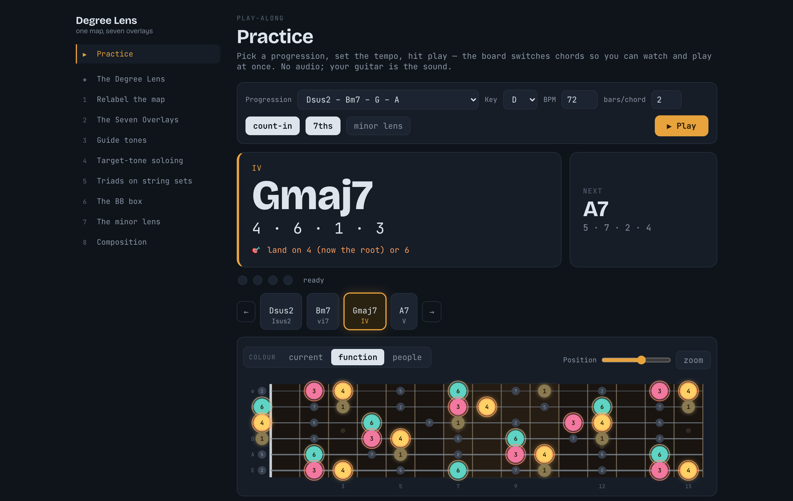
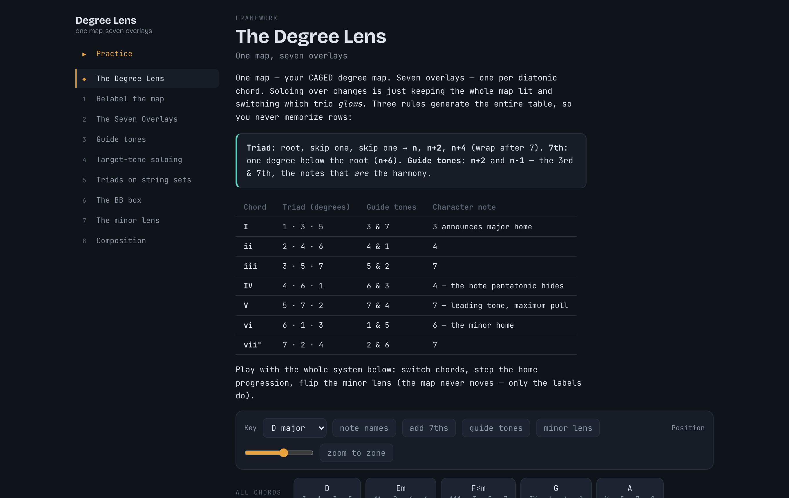

# Degree Lens — One Map, Seven Overlays

An interactive chord-tone soloing workbook for guitar. The full parent-scale map
stays lit on a fretboard; pick a chord and its degree-trio **glows** — *same map,
different glow*. Everything is expressed in **scale degrees** (note names are a
toggleable secondary label), built for a CAGED-fluent, number-thinking,
minor-leaning player.

A static single-page app — **Vite + React + TypeScript**, no backend, no audio,
no accounts. You supply the sound with an actual guitar.



## What it is

Soloing over changes = keep the whole CAGED degree-map lit, and per chord make
its degree-trio glow. Three rules generate the whole system, so you never
memorize a table:

- **Triad** — root, skip one, skip one → `n · n+2 · n+4` (wrap after 7)
- **7th** — one degree below the root (`n+6`)
- **Guide tones** — `n+2` and `n−1` (the 3rd & 7th — *the notes that are the harmony*)

Minor is a relabeling, not a new map: the minor tonic lives on major degree `6`,
and the whole app can re-read every label through that lens without the dots
moving an inch.

## Features

- **Live fretboard** — degrees as the primary label, note names one toggle away;
  7ths, guide tones, minor lens, and a CAGED position window (with a mobile-friendly zoom).
- **Three colour modes** — `current`, `function` (root / 3rd-quality / 7th-tension /
  5th-furniture + a spotlight on each chord's character note), and `people`
  (the guide tones glow, root & 5th recede).
- **Progression stepper** — presets plus a silent visual metronome; the *fresh
  note* pulses to announce each change.
- **▶ Practice** — a distraction-free play-along page: big now-playing chord,
  next-chord preview, change countdown, count-in bar, and a custom progression builder.
- **Triad windows & the BB box** — the nine string-set windows per chord, and a
  box-locked board for one-position practice.
- **The full 8-module curriculum** as an interactive notebook, each lesson with
  embedded live widgets and a progress checklist.



## Develop

```sh
npm install
npm run dev        # dev server at http://localhost:5173
npm test           # vitest — theory acceptance suite + component/interaction tests
npm run build      # typecheck + production build to dist/
npm run lint:tabs  # verify every fret number in the source markdown against theory.ts
```

## Architecture

```
src/
  lib/
    theory.ts          # ALL music math (pure, unit-tested) — the single source of truth
    progressions.ts    # named progressions (major + minor lens)
    useMetronome.ts     # shared silent-metronome timing hook
  components/
    Fretboard.tsx       # SVG board, windowed rendering + colour modes
    DegreeLens.tsx       # the embeddable overlay widget (board + controls + stepper)
    OverlayControls.tsx  ProgressionStepper.tsx  ColorModeToggle.tsx
    TriadWindows.tsx  BoxView.tsx  Lesson.tsx  PracticeSession.tsx
  content/
    curriculum.tsx       # the 8 modules + overview, with embedded widgets
  App.tsx                # sidebar nav + lesson pane (hash-routed)
scripts/
  lint-tabs.mjs          # number-honesty linter (imports theory.ts directly)
```

**Guardrails:** all intervals are computed in `theory.ts` — components never
compute music inline. Degrees are the primary label everywhere; note names are a
secondary, derived toggle.

## Content source of truth

- `01-VISION-AND-FRAMEWORK.md` — the framework (seven overlays, the minor lens)
- `02-CURRICULUM.md` — the 8-module curriculum
- `03-BUILD-SPEC.md` — the build spec this app implements
- `degree-lens-demo.html` — the original single-file reference implementation

## Deploy

Pushing to `main` builds and publishes to GitHub Pages via
`.github/workflows/deploy.yml` (enable Pages → *Source: GitHub Actions* in repo
settings once). The build uses a relative base, so `dist/` also opens directly
from `file://`.

## Mobile (Android, Capacitor)

The app is Capacitor-ready. Native behavior (dark status bar, Android back
button, landscape-lock in Practice) lives in `src/lib/native.ts`, guarded by
`isNative()` so the web build is unaffected. `capacitor.config.ts` is committed;
the generated `android/` project is **gitignored** (regenerate it any time).

Prerequisites (one-time): **Android Studio + JDK 17 + Android SDK**.

```sh
npm run mobile:add       # generate the android/ project (once)
npm run mobile:sync      # build web + copy into the native project
npm run mobile:android   # open in Android Studio to run on a device
```

Practice locks to landscape on device; the rest of the app rotates freely.

**Distribution reality:**
- *Personal use* — build a debug APK in Android Studio (or run the manual
  **Android debug APK** GitHub Action) and sideload. Free, minutes.
- *Play Store* — $25 one-time; new personal accounts must run a closed test
  (12 testers / 14 days) before production. Not worth it for a single-user app.

Once you start customizing the native shell (icons, splash, manifest), un-ignore
`/android` in `.gitignore` and commit it.
